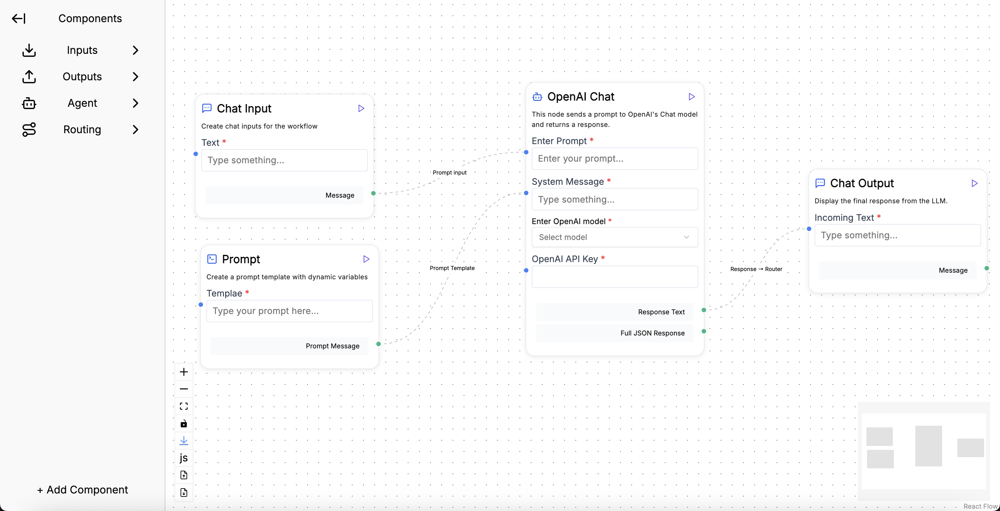

# `json-to-reactflow`



Turn structured JSON into an editable, interactive visual flow powered by [React Flow](https://reactflow.dev/).
Now supports deeply nested inputs/outputs, folders, dynamic forms, and visual routing.


📦 Modular | ✨ Real-time Editing | 🧠 AI-Compatible | 🧩 Plug-and-play

---

## 🚀 Installation

```bash
npm install json-to-reactflow
```

---

## ⚡ Quick Start

```tsx
import { JsonToReactFlow } from "json-to-reactflow";
import { flowJson, sidebarJson } from "./your-json-data";

function App() {
  return (
    <div style={{ width: "100vw", height: "100vh" }}>
      <JsonToReactFlow flowJson={flowJson} sidebarJson={sidebarJson} />
    </div>
  );
}
```

---

## 📘 Props

### `JsonToReactFlow` Props

| Prop          | Type              | Required | Description                                              |
| ------------- | ----------------- | -------- | -------------------------------------------------------- |
| `flowJson`    | `FlowJson`        | ✅       | JSON describing canvas, nodes, edges, and background     |
| `sidebarJson` | `SideBarJsonType` | ❌       | Optional. Sidebar with folders, templates, and previews. |

---

## 🧠 Flow JSON Structure

```ts
export interface FlowJson {
  export?: boolean;
  control?: boolean;
  minimap?: boolean;
  background?: {
    color?: string;
    bgcolor?: string;
    variant?: "dots" | "lines" | "cross";
    size?: number;
  };
  nodes: Node[]; // visit https://reactflow.dev/api-reference/types/node for more info
  edges: Edge[]; // visit https://reactflow.dev/api-reference/types/edge for more info
}
```

---

## 🧱 Sidebar JSON

### `SideBarJsonType`

```ts
type SideBarJsonType = {
  folders: Folder[];
};

type Folder = {
  folderName: string;
  icon: string;
  item: Item[];
};

type Item = {
  label: string;
  icon: string;
  data: NodeData;
};
```

### `NodeData` Interface

```ts
type NodeData = {
  name?: string;
  display_name?: string;
  display_icon?: string;
  description?: string;
  inputs?: InputField[];
  outputs?: Output[];
  [key: string]: any;
};

type InputField = {
  name: string;
  label?: string;
  placeholder?: string;
  type: "text" | "dropdown" | "checkbox" | "switch";
  options?: string[];
  defaultValue?: any;
  handlePresent?: boolean;
  value: string | boolean;
  required?: boolean;
};

type OutputField = {
  name: string;
  type: string;
  description?: string;
};
```

---

## 🧪 Example Data
For a more extensive example JSON, please visit [FlowJson.ts on GitHub](https://github.com/NishantGupta827/json-to-reactflow-npm-package/blob/main/src/testJson/FlowJson.ts).


### Sidebar Example

```ts
export const sidebarJson: TestJsonType = {
  folders: [
    {
      folderName: "Inputs",
      icon: "input",
      item: [
        {
          label: "Text Input",
          icon: "text",
          data: {
            name: "TextInputNode",
            display_name: "Text Input",
            description: "A simple text input node.",
            inputs: [
              {
                name: "textInput",
                label: "Enter text",
                type: "text",
                placeholder: "Type something...",
                required: true,
                handlePresent: true,
                value: "",
              },
            ],
            outputs: [
              {
                name: "textOutput",
                type: "text",
                description: "User-entered text",
              },
            ],
          },
        },
      ],
    },
  ],
};
```

### Flow JSON Example

```ts
export const flowJson: FlowJson = {
  export: true,
  control: true,
  minimap: true,
  background: {
    color: "#000000",
    bgcolor: "#ffffff",
    variant: "cross",
    size: 1,
  },
  nodes: [
    {
      id: "node_1",
      type: "custom",
      position: { x: 100, y: 150 },
      data: {
        name: "OpenAIChatNode",
        display_name: "OpenAI Chat",
        description: "Send prompt to OpenAI and get results",
        inputs: [
          {
            name: "prompt",
            label: "Enter Prompt",
            type: "text",
            placeholder: "Enter your prompt...",
            required: true,
            handlePresent: true,
            value: "",
          },
          {
            name: "system_message",
            type: "text",
            label: "System Message",
            placeholder: "Type something...",
            required: true,
            handlePresent: true,
            value: "",
          },
          {
            name: "model",
            type: "dropdown",
            label: "Enter OpenAI model",
            options: ["gpt-3.5-turbo", "gpt-4"],
            placeholder: "Select model",
            required: true,
            handlePresent: false,
            value: "",
          },
          {
            name: "key",
            type: "text",
            label: "OpenAI API Key",
            placeholder: "",
            required: true,
            handlePresent: true,
            value: "",
          },
        ],
        outputs: [
          {
            name: "Response Text",
            type: "text",
            description: "The raw response from the model",
          },
          {
            name: "Full JSON Response",
            type: "data",
            description: "The complete JSON response object",
          },
        ],
      },
    },
    // Other nodes (node_2)...
  ],
  edges: [
    {
      id: "e1",
      source: "node_2",
      target: "node_1",
      targetHandle: "input-prompt",
      animated: true,
      label: "Prompt input",
    },
  ],
};
```

---

## 🛠 Features

- ✅ Supports nested `inputs` and `outputs`
- 🧰 Drag-and-drop templating via sidebar folders
- ⚡ Real-time node editing using JSON Editor
- 🎨 Custom icons(from lucide-react) and colors
- 🔌 Connect nodes with dynamic handle IDs
- 🧩 Extendable with new node types and logic

---

Here is the updated `License` section with the full MIT license text you provided:

---

## 📄 License

```
MIT License

Copyright (c) 2024 json-to-reactflow

Permission is hereby granted, free of charge, to any person obtaining a copy
of this software and associated documentation files (the "Software"), to deal
in the Software without restriction, including without limitation the rights
to use, copy, modify, merge, publish, distribute, sublicense, and/or sell
copies of the Software, and to permit persons to whom the Software is
furnished to do so, subject to the following conditions:

The above copyright notice and this permission notice shall be included in all
copies or substantial portions of the Software.

THE SOFTWARE IS PROVIDED "AS IS", WITHOUT WARRANTY OF ANY KIND, EXPRESS OR
IMPLIED, INCLUDING BUT NOT LIMITED TO THE WARRANTIES OF MERCHANTABILITY,
FITNESS FOR A PARTICULAR PURPOSE AND NONINFRINGEMENT. IN NO EVENT SHALL THE
AUTHORS OR COPYRIGHT HOLDERS BE LIABLE FOR ANY CLAIM, DAMAGES OR OTHER
LIABILITY, WHETHER IN AN ACTION OF CONTRACT, TORT OR OTHERWISE, ARISING FROM,
OUT OF OR IN CONNECTION WITH THE SOFTWARE OR THE USE OR OTHER DEALINGS IN THE
SOFTWARE.
```

---

## Usage

### Basic Usage

```jsx
import { JsonToReactflow } from 'json-to-reactflow';

function App() {
  return (
    <JsonToReactflow
      serviceJson={yourServiceData}
      agentJson={yourAgentData}
      nodeOptions={yourNodeOptions}
      onFlowChange={(data) => console.log('Flow updated:', data)}
    />
  );
}
```

### Fixing "React Flow parent container needs width and height" Error

If you encounter the error about parent container dimensions when using this package, you can fix it by providing explicit dimensions:

```jsx
import { JsonToReactflow } from 'json-to-reactflow';

function App() {
  return (
    <div style={{ width: '100vw', height: '100vh' }}>
      <JsonToReactflow
        serviceJson={yourServiceData}
        agentJson={yourAgentData}
        nodeOptions={yourNodeOptions}
        height="100vh"
        width="100%"
        onFlowChange={(data) => console.log('Flow updated:', data)}
      />
    </div>
  );
}
```

### Custom Container

```jsx
import { JsonToReactflow } from 'json-to-reactflow';

function App() {
  return (
    <div className="my-flow-container">
      <JsonToReactflow
        serviceJson={yourServiceData}
        agentJson={yourAgentData}
        nodeOptions={yourNodeOptions}
        height="600px"
        width="800px"
        onFlowChange={(data) => console.log('Flow updated:', data)}
      />
    </div>
  );
}
```

## Props

- `serviceJson`: FlowJson - The flow data structure
- `agentJson`: AgentConfig - Agent configuration data  
- `nodeOptions`: NodeOptionsJson - Available node types and options
- `onFlowChange?: (data: { nodes: Node[]; edges: Edge[] }) => void` - Callback when flow changes
- `height?: string | number` - Container height (default: "100vh")
- `width?: string | number` - Container width (default: "100%")

## Features

- Interactive ReactFlow diagram
- Collapsible sidebar with agent configuration
- Node editing capabilities
- Flow export/import functionality
- Responsive design

---
# json-to-reactflow
